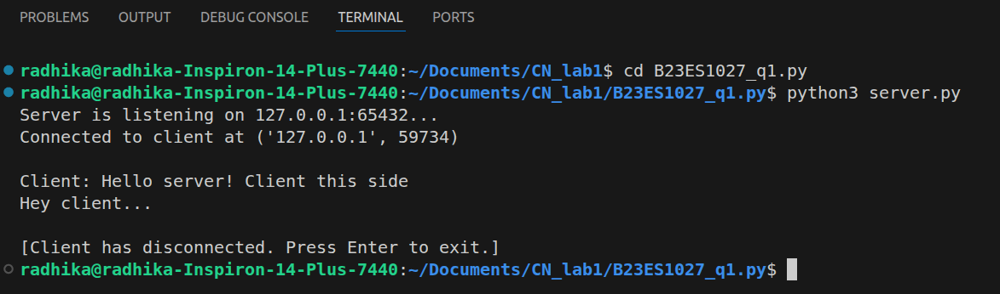
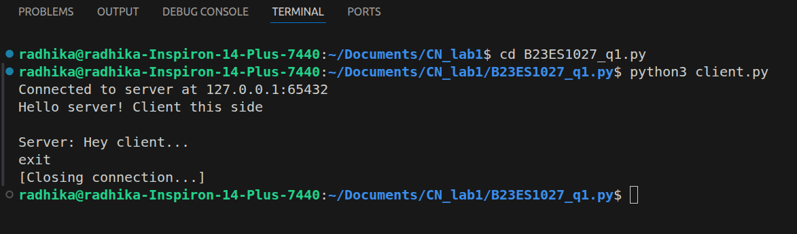

# Computer Networks Lab 1: Client-Server Communication

**Author:** [Radhika Agarwal / B23ES1027]
**Course:** Computer Networks 

## Assignment Overview
This assignment demonstrates a basic Client-Server architecture using Python. It serves as an introductory lab to understand how network sockets work, how a server binds to a port to listen for incoming connections, and how a client initiates communication. 

## Prerequisites
* **Python 3.x:** Ensure Python 3 is installed on your system.
* **Operating System:** Linux/Ubuntu (or any OS with a bash terminal).

*(Note: If your Ubuntu system says `Command 'python' not found`, you can safely use `python3` instead, or run `sudo apt install python-is-python3` to link the command).*

## How to Run

To test the communication, you will need to open **two separate terminal windows**: one for the server and one for the client.

### Step 1: Start the Server
Open your first terminal, navigate to the project directory, and start the server:
```bash
cd ~/Documents/CN_lab1
python3 server.py
```
### Step 2: Start the Client

Open a second terminal window, navigate to the same directory, and run the client script:
```bash
cd ~/Documents/CN_lab1
python3 client.py
```
### Step 3: Interact

Once both are running, type a message into the client terminal and press Enter. You should see the message received by the server and a response sent back to the client.

## Core Concepts Explored

This lab covers several foundational networking concepts:

* **Client-Server Architecture:** A distributed application structure that partitions tasks or workloads between the providers of a resource or service (servers) and service requesters (clients).
* **Sockets:** The endpoints of a two-way communication link between two programs running on the network. A socket is bound to a port number so that the TCP layer can identify the application that data is destined to be sent to.
* **IP Address & Ports:** * The **IP address** (e.g., `127.0.0.1` or `localhost`) identifies the specific machine on the network.
  * The **Port** (e.g., `8080` or `12345`) identifies the specific application or process running on that machine.
* **TCP (Transmission Control Protocol):** *(If your lab uses `SOCK_STREAM`)* A connection-oriented protocol that ensures reliable, ordered, and error-checked delivery of a stream of bytes.

## Test Results:

### Server Listening and Receiving Data


### Client Sending Data

